<picture>
  <source media="(prefers-color-scheme: dark)" srcset="assets/blueprint-dark.svg">
  <source media="(prefers-color-scheme: light)" srcset="assets/blueprint-light.svg">
  
</picture>

```text
BILL OF MATERIALS                                              SHEET 1/4
──────────────────────────────────────────────────────────────────────
 NO.  CATEGORY         SPEC
 01   LANGUAGES        Java · Python · C · JavaScript · TypeScript
                        SQL · Haskell
 02   WEB / SERVICES   React · Express · Node.js · MongoDB
 03   TOOLING          Git · Linux · Pandas · NumPy · SQLite
 04   OTHER            JavaFX · Unity
──────────────────────────────────────────────────────────────────────
```

```text
PROJECT INDEX                                                  SHEET 2/4
──────────────────────────────────────────────────────────────────────
 DoorDash               Java / JavaFX board game — MVC architecture
 ReservationEngine      Haskell + Prolog scheduling engine
 CSV-Parser-Analyzer    Java CLI — sort, filter, export
 Movie_recommender      Python / Pandas / SQLite recommender CLI
 MovieRecommender-MERN  MERN rewrite of the above          [in progress]
──────────────────────────────────────────────────────────────────────
```

```text
REVISION HISTORY                                               SHEET 3/4
──────────────────────────────────────────────────────────────────────
 2025 —      IEEE, SE Committee — GUC Student Branch
 2024        VectorGSC, Game Dev — Vector Game Studio Club
──────────────────────────────────────────────────────────────────────
```

```text
TITLE BLOCK                                                    SHEET 4/4
──────────────────────────────────────────────────────────────────────
 NAME         Abdelrahman Nader
 DISCIPLINE   Computer Engineering, GUC
 GITHUB       github.com/Abdo-N
 LINKEDIN     linkedin.com/in/abdelrahman-morad
 STATUS       OPEN TO SOFTWARE ENGINEERING / DATA INTERNSHIPS
──────────────────────────────────────────────────────────────────────
```
