<div align="center">



# Hey, I'm Abdelrahman Nader 👋

### Computer Engineering student · Full-stack developer · Problem solver

I enjoy turning ideas into reliable software — from web applications and data tools  
to games and scheduling engines.

[](https://www.linkedin.com/in/abdelrahman-morad)
[](mailto:abdelrahmannohman33@gmail.com)
[](https://github.com/Abdo-N)

</div>

---

### A little about me

```javascript
const abdelrahman = {
  education: "Computer Engineering @ GUC",
  interests: ["Full-stack development", "Data", "Game development"],
  communities: ["IEEE GUC — Software Engineering", "VectorGSC — Game Dev"],
  currentlyBuilding: "Useful software, one commit at a time",
  openTo: ["Software engineering internships", "Data internships"]
};
```

### Tech I work with

<div align="center">


</div>

### Industrial work

> #### 🏭 EGAS Employee Clearance System
> A bilingual, Arabic-first platform that digitizes the employee clearance
> workflow across 13 departments—from request creation and evidence-backed
> signatures to final IT access revocation and generation of the official
> clearance PDF.

| Variant | Highlights | Stack |
| :--- | :--- | :--- |
| [Active Directory edition](https://github.com/Abdo-N/Egas-clearance-AD) | Role-based dashboards, tiered departmental approvals, IT access-revocation workflow, analytics, and audit-ready evidence | React, Node.js, Express, MongoDB |
| [Standalone edition](https://github.com/Abdo-N/Egas-clearance-standalone) | Self-contained deployment with Arabic/English UI, dark mode, secure re-authentication, document uploads, and generated clearance PDFs | React, Node.js, Express, MongoDB |

### Selected projects

| Project | What it does | Built with |
| :--- | :--- | :--- |
| [DoorDash](https://github.com/Abdo-N/DoorDash) | A board game designed around a clean MVC architecture | Java, JavaFX |
| [ReservationEngine](https://github.com/Abdo-N/ReservationEngine) | A declarative scheduling and reservation engine | Haskell, Prolog |
| [CSV Parser & Analyzer](https://github.com/Abdo-N/CSV-Parser-Analyzer) | A CLI for sorting, filtering, analyzing, and exporting CSV data | Java |
| [Movie Recommender](https://github.com/Abdo-N/Movie_recommender) | A command-line movie recommendation system | Python, Pandas, SQLite |
| [Movie Recommender — MERN](https://github.com/Abdo-N/Movie_Recommender--MERN-) | A full-stack reimagining of the movie recommender | MongoDB, Express, React, Node.js |

---

<div align="center">

#### Let's build something thoughtful.

<sub>Thanks for stopping by — feel free to explore my repositories or reach out.</sub>

</div>
